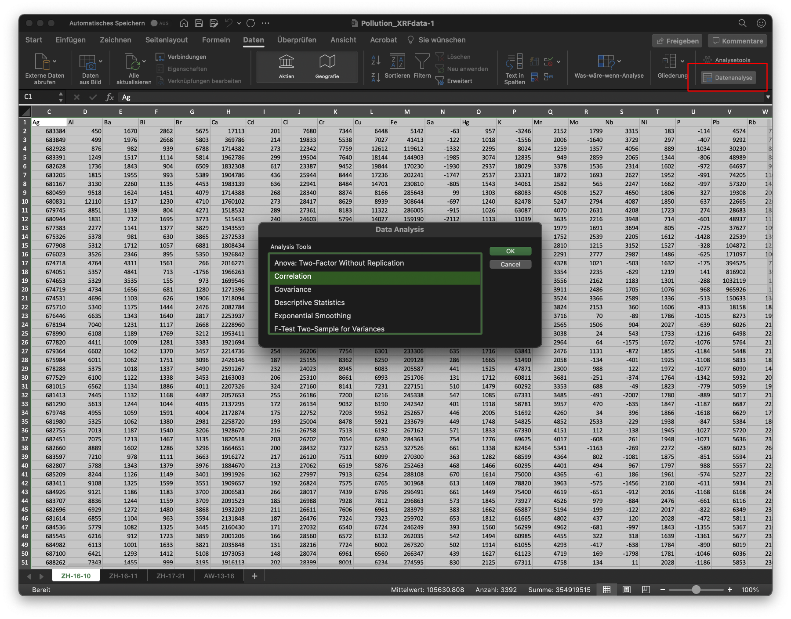
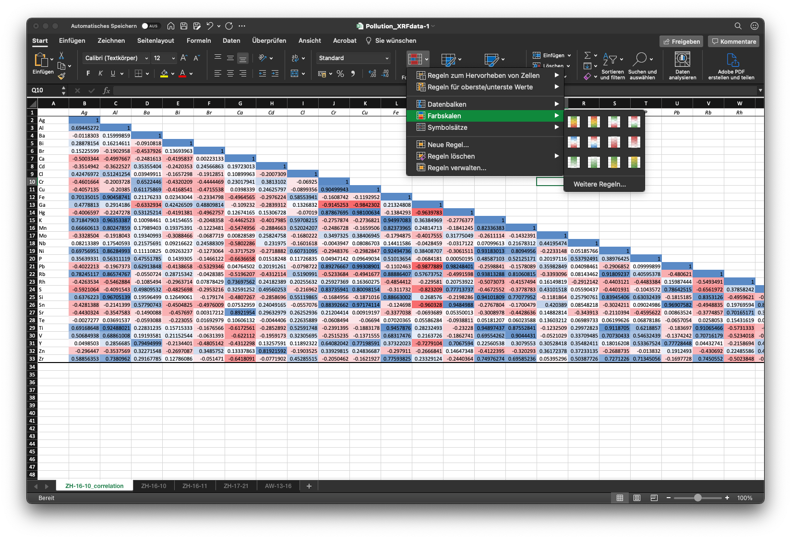

During the course of the Limnogeology lecture you have been given different kind of data related to sediment cores. In many cases, limnogeology is a rather disciplinary approach and one is sometimes confronted and overwhelmed with a plentitude of information. Following some ideas how you can extract the most important information. These ideas generally work for different data handling and visualisation pipelines, be it with Microsoft Excel or with a programming language, but some functions might not be available everywhere.

# The first step: Measuring and creating data
The first step in any data analysis is the experiment, observation, measurement that creates the data. It is important to have at least a basic understanding of what you are measuring and what some pitfalls of common methods are, which is why this is also a part of the lecture.

# Importing, cleaning and inspecting data
The data that is produced by analytical equipment tends to come in many different shapes and formats. Sometimes we are lucky and receive already clean and tidy data, but this is not always the case. Whether you're using a spreadsheet software or a programming language, you should always make sure that you can properly open/read your data. Once you opened the data, get a quick overview of what you are looking at (some first quick plots, some summary statistics, looking for missing values et cetera).

In some cases you will have to do further calculations or transformations with your data. If you are using Microsoft Excel or LibreOffice/OpenOffice, make sure that your formulas point to the correct cells and make use of fixed cell references. If you are using code, make sure to keep track of your transformations and write comments about what you were doing!

# Exploring your data
The best way to explore your data is visually. Start with some simple scatter or line plots, add colours and shapes, use facets and transformations.

Quite often, you'll have some prior knowledge as to what exactly you are looking for or where you are looking for something. Linescans/core photos can help with the decision too. In the next step, you will often look at XRF Corescan data. It is helpful to look for correlation patterns and/or focus on elements of interest.

## Exploring correlations with Microsoft Excel

Microsoft Excel and other spreadsheet applications allow for some statistical analyses including the calculation of a correlation matrix. To this end, make sure that your XRF element traces are in a wide format, i.e. every line is a different depth in the sediment core and every column is a different element.

You can find the data analysis tools on the `Data` ribbon tab. Maybe you will have to activate the tools first in the settings (above red square in screenshot).



You will have to mark all the element traces that you want to include in the correlation matrix (do not include core name and depths, just the data you want to compare), check if you have a header and where you want to create the correlation matrix. The result is in the next screenshot:


Using Excel's conditional formatting it's possible to fill the cells with different colours according to their value. One disadvantage of this method is, that the correlation matrix has the same order as the original input data, i.e. there is no clustering of similar traces, which makes spotting patterns difficult.

## Exploring correlations with R

Using R we can use the `corrplot` package to easily visually distinguish between groups of related element traces. We're using sample data from Lake Zug to this end. The only prior information in this case is that we expect some lead pollution.

We start by loading the necessary packages for our analysis and loading the previously parsed xrf data.

```{r}
# Loading necessary packages - if this fails, chances are that you haven't installed a package
library(tidyverse)
library(corrplot)
library(plotly)


# Load XRF data from file in same folder
load("xrfdata_limno21_sampledata.RData")

# Looking at our data
glimpse(xrfdata_lakezug)
```
The output of the `glimpse` command shows us the structure of our data. There are 21 variables/columns and 38068 observations/rows. `<chr>` shows us that a variable contains texts (chr is abbreviated for char), while `<dbl>` stands for double -- which in turn means floating point number with double precision. There is also additional data that was created by the XRF corescanner that is not needed for our analysis. We only need to keep the variables/columns `CoreID` (which is effectively the core name), `Depth` (which is the core depth without green stuff in mm), `Element` and `cps` (short for counts per second -- counts or integral area from older XRF data, but corrected for different measuring times). It is a good idea to tell R that `Element` and `CoreID` are *categorical variables* or so called *factors* in R. Factors have some added benefits over raw text variables.

```{r}
# We mutate two variables in our dataframe, turning them into factors and saving the changes back into the same dataframe.
xrfdata_lakezug <- xrfdata_lakezug %>% 
  mutate(CoreID = as_factor(CoreID), Element = as_factor(Element))

glimpse(xrfdata_lakezug)
```

Additionally, we need to turn this long format table (one column for Elements and one column for cps) into a wide-format table (as in the Excel screenshot above) to satisfy the `cor` function that computes the correlation matrix:

```{r}
# We take our dataframe with the name xrfdata_lakezug and "feed it" with the pipe symbol %>% into the next function, where we select the columns of interest. In the next step, we expand the long format table back to a wide format table. The result of this pipeline is assigned to the new dataframe xrfwide. This syntax is also called a tidyverse pipeline and is a modern, more consistent form of R.
xrfwide <- xrfdata_lakezug %>% 
  select(CoreID, Depth, Element, cps) %>% 
  pivot_wider(names_from = Element, values_from = cps)

glimpse(xrfwide)
```
The previous not needed variables disappeared and we can now see that we have the same wide structure as before with Excel.

We can now inspect every core separately, but need to know how many cores there are first (of course you could also check out the linescans or the dataframe structure visually if you are using RStudio). Since the `CoreID` variable is a factor now, R knows how many distinct states, so called levels there are:

```{r}
levels(xrfwide$CoreID)
```

We can now create the correlation matrices for every core and plot a correlation plot. We choose to display only the upper half of the correlation plot and we use hierarchical clustering to group very similar variables together:

```{r}
# Read from the inside to the outside: We filter xrfwide to only have the data of one core, then remove the core name and depth for the correlation analysis. The correlation table is then assigned to xrfwide_zug18_7.
xrfwide_zug18_7 <- cor(xrfwide %>% filter(CoreID == "ZUG18-7") %>% select(-CoreID, -Depth))

corrplot(xrfwide_zug18_7, type = "upper", order = "hclust", tl.col="black", mar=c(0,0,1,0), title = "Correlation plot for XRF data of ZUG18-7")
```

```{r}
xrfwide_zug18_8 <- cor(xrfwide %>% filter(CoreID == "ZUG18-8") %>% select(-CoreID, -Depth))

corrplot(xrfwide_zug18_8, type = "upper", order = "hclust", tl.col="black", mar=c(0,0,1,0), title = "Correlation plot for XRF data of ZUG18-8")
```

```{r}
xrfwide_zug18_9 <- cor(xrfwide %>% filter(CoreID == "ZUG18-9") %>% select(-CoreID, -Depth))

corrplot(xrfwide_zug18_9, type = "upper", order = "hclust", tl.col="black", mar=c(0,0,1,0), title = "Correlation plot for XRF data of ZUG18-9")
```

We can see from the correlation plots that there are some common groups of positive correlations between elements. However, we don't know how valid these are (interferences are possible), we don't know how high the counts/cps are etc. It does seem though that Pb is mostly co-occuring with Zn.


```{r}
# We are creating a ggplot2 plot object. The plot consists of three separate panels, so called facets. The panels are facetted by core name. Plotly is a plotting library used for web graphics that helps us to bring our static plots to life.
plotobj <- ggplot(xrfdata_lakezug, aes(x = Depth, y = cps, colour = Element)) + geom_line() + coord_flip() + scale_x_reverse() + facet_wrap(~ CoreID)

ggplotly(plotobj)
```

Luckily for us, we can make interactive plots where we can turn every element separately on or off. Additionally, we can scale and zoom into our data. A good strategy would be to check for the previously discovered groups.

If we look e.g. only at Pb and Zn, our plot will look similar to this:

```{r}
ggplot(xrfdata_lakezug %>% filter(Element %in% c("Pb", "Zn")), aes(x = Depth, y = cps, colour = Element)) + geom_line() + coord_flip() + scale_x_reverse() + facet_wrap(~ CoreID, scales = "free")
```

Lead and zinc clearly occur around the same time. The lead peak in ZUG18-9 could be an outlier/measurement error. To confirm this, we would have to inspect the errors (`cpsStd`) and the model fitting efficiency (`Chi2`) or even the XRF spectrum at the specific interval.
